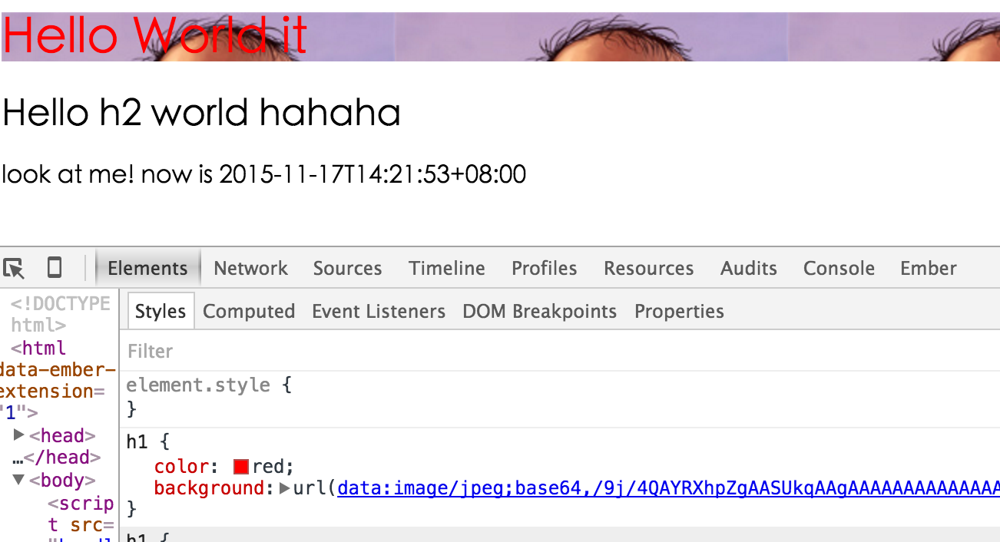
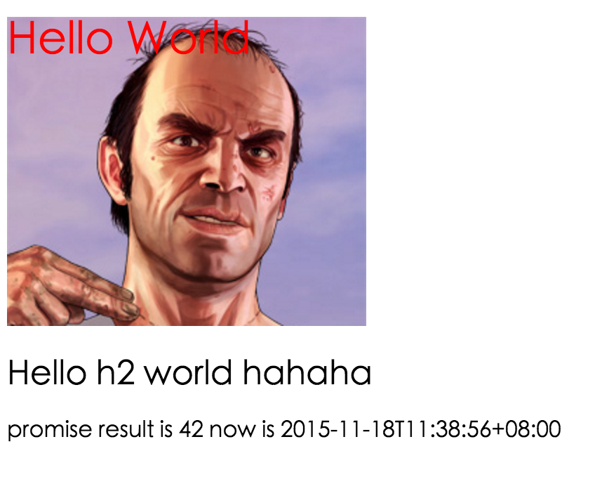

## Webpack傻瓜式指南（一）

**因为这篇启蒙文章比较受大家欢迎，在操作过程中大家也遇到很多坑，所以于2016.2.25更新 在文章最后总结了各种出现的错误**

webpack最近很热，我一开始是想翻译一篇国外关于webpack的佳作，但是找来找去也没有一篇让我感觉到很满意的，好多都是一步到位，满屏幕都是React＋Webpack，官方文档写的不太好，好多点都没有解释的详细，所以我参考了几篇文章，写一篇容易上手的指南。本文适合第一次接触webpack的朋友，如果是老鸟，就不用看了。这是系列的第一篇，主要讲他最基本的用法。

### 比较

如果你熟悉原来一系列的构建工具，grunt或者gulp之类的，这里有一篇webpack和他们比较的文章可以读一读。
[Webpack Compared](http://survivejs.com/webpack_react/webpack_compared/)


### 安装

先装好node和npm，因为webpack是一个基于node的项目。然后

```bash
npm install -g webpack
```

### 总览
官网对webpack的定义是MODULE BUNDLER，他的目的就是把有依赖关系的各种文件打包成一系列的静态资源。 请看下图


webpack简单点来说就就是一个配置文件，所有的魔力都是在这一个文件中发生的。
这个配置文件主要分为三大块

* entry 入口文件 让webpack用哪个文件作为项目的入口
* output 出口 让webpack把处理完成的文件放在哪里
* module 模块 要用什么不同的模块来处理各种类型的文件

下面我们就一步一步来新建一个简单的项目

### 建立项目

建一个文件夹，然后新建一个package.json的文件在项目根目录下

```bash
mkdir webpack
cd webpack
npm init
# 一直点回车 如果懒得填一些信息
```
如果你使用git管理你的这个项目的话，建议你新建一个.gitignore文件，不要让git提交一些node依赖的模块， 你也可以参考github的例子
https://github.com/github/gitignore/blob/master/Node.gitignore

我们这里就简单一点
```bash
node_modules
```

### 项目结构
现在项目里面就有一个package.json， 我们多加一点东西，慢慢丰富它的内容。
* /app
	* index.js
	* sub.js
* package.json
* webpack.config.js

添加了两个js文件，添加了最重要的webpack的配置文件，我们还是从非常简单的hello world开始玩起，webpack原生直接支持AMD和CommonJS两种格式，如果你想使用ES6的风格，这点以后再提。

### JS代码

**sub.js**

```javascript
//我们这里使用CommonJS的风格
function generateText() {
  var element = document.createElement('h2');
  element.innerHTML = "Hello h2 world";
  return element;
}

module.exports = generateText;
```

**index.js**

```javascript
var sub = require('./sub');
var app  = document.createElement('div');
app.innerHTML = '<h1>Hello World</h1>';
app.appendChild(sub());
document.body.appendChild(app);
```
代码写完了，完成一个很简单的功能，新建一个单独的module，并且在另外一个module里面引用他，最后会在页面里面输出两个标题。

### 配置Webpack

现在开始配置webpack，目标是把这两个js文件合并成一个文件. 我们可以自己在build文件夹里面手动建一个index.html文件夹，然后再把合并以后的js引用在里面，但是这样有些麻烦，所以我们这里安装一个plugin，可以自动快速的帮我们生成HTML。

```bash
npm install html-webpack-plugin --save-dev
```

好 有了这个插件 开始写config文件

```javascript

var path = require('path');
var HtmlwebpackPlugin = require('html-webpack-plugin');
//定义了一些文件夹的路径
var ROOT_PATH = path.resolve(__dirname);
var APP_PATH = path.resolve(ROOT_PATH, 'app');
var BUILD_PATH = path.resolve(ROOT_PATH, 'build');

module.exports = {
  //项目的文件夹 可以直接用文件夹名称 默认会找index.js 也可以确定是哪个文件名字
  entry: APP_PATH,
  //输出的文件名 合并以后的js会命名为bundle.js
  output: {
    path: BUILD_PATH,
    filename: 'bundle.js'
  },
  //添加我们的插件 会自动生成一个html文件
  plugins: [
    new HtmlwebpackPlugin({
      title: 'Hello World app'
    })
  ]
};
```
然后在项目根目录运行

```bash
webpack
```
终端显示一堆信息，然后告诉你成功了。

> 你可以使用webpack --help看看一些运行的时候可选的参数

你会发现多出来一个build文件夹，直接点开里面的html文件，你会发现我们可爱的“hello world”已经插入到页面了。我们的任务完成了，成功生成html，合并js，html引入了js，js被执行了。

### 配置webpack-dev-server

上面任务虽然完成了，但是我们要不断运行程序然后查看页面，所以最好新建一个开发服务器，可以serve我们pack以后的代码，并且当代码更新的时候自动刷新浏览器。

安装webpack-dev-server

**更新, 这里还是全局安装比较好**

```bash
npm install webpack-dev-server －g
```
安装完毕后 在config中添加配置

```javascript
module.exports = {
  ....
  devServer: {
    historyApiFallback: true,
    hot: true,
    inline: true,
    progress: true,
  },
  ...
}
```

然后再package.json里面配置一下运行的命令,npm支持自定义一些命令

```javascript
...
"scripts": {
  "start": "webpack-dev-server --hot --inline"
},
...
```

好了，万事具备了，在项目根目录下输入npm start,一堆花花绿绿的信息后server已经起来了，在浏览器里面输入http://localhost:8080 发现伟大的hello world出现了，在js里面随便修改一些输出然后保存, boom!浏览器自动刷新，新的结果出现了。

> 拓展阅读
如果你的服务器端使用的是express框架，你还可以直接安装express的middleware，webpack配合express，很好用。
```bash
npm install webpack-dev-middleware --save-dev
```

更多的详情 请参考这篇文章

[https://blog.risingstack.com/using-react-with-webpack-tutorial/](https://blog.risingstack.com/using-react-with-webpack-tutorial/)

### 添加CSS样式

现在来添加一些样式，webpack使用loader的方式来处理各种各样的资源，比如说样式文件，我们需要两种loader，css-loader 和 style－loader，css-loader会遍历css文件，找到所有的url(...)并且处理。style-loader会把所有的样式插入到你页面的一个style tag中。

安装我们的loader

```bash
npm install css-loader style-loader --save-dev
```

配置loader，在webpack.config.js中

```javascript
  devServer: {
    historyApiFallback: true,
    hot: true,
    inline: true,
    progress: true,
  },
  ...
  module: {
    loaders: [
      {
        test: /\.css$/,
        loaders: ['style', 'css'],
        include: APP_PATH
      }
    ]
  },
  ...
  plugins: [
    new HtmlwebpackPlugin({
      title: 'Hello World app'
    })
  ]
```
看loaders的书写方式，test里面包含一个正则，包含需要匹配的文件，loaders是一个数组，包含要处理这些程序的loaders，这里我们用了css和style，注意loaders的处理顺序是从右到左的，这里就是先运行css-loader然后是style-loader.

新建一个样式文件 main.css

```css
h1 {
	color: red;
}
```
记得在入口文件index.js中引用
```javascript
require('./main.css');
```
然后发现标题变成红色的了，webpack的理念是基于项目处理的，把对应的文件格式给对应的loader处理，然后你就不用管了，它会决定怎么压缩，编译。

那现在想使用一些有爱的css预编译程序，来点sass吧。 你可能已经想到了，再来个loader就行啦，确实是这样简单。

**更新 这里还需要添加node-sass来解析sass文件**

```bash
npm install sass-loader node-sass --save-dev
```

稍微修改一下config，删掉我们先前添加的css规则，加上下面的loader

```javascript
      {
        test: /\.scss$/,
        loaders: ['style', 'css', 'sass'],
        include: APP_PATH
      },
```
添加两个sass文件，variables.scss和main.scss

variables.scss

```css
$red: red;
```

main.scss

```css
@import "./variables.scss";

h1 {
  color: $red;
}
```
在index.js中引用

```javascript
require('./main.scss');
```

然后发现标题如愿变红，相当简单吧。

### 处理图片

这个和其他一样，也许你也已经会玩了。安装loader，处理文件。不过有个神奇的地方它可以根据你的需求将一些图片自动转成base64编码的，为你减轻很多的网络请求。

安装url-loader

```bash
npm install url-loader --save-dev
```

配置config文件

```javascript
      {
        test: /\.(png|jpg)$/,
        loader: 'url?limit=40000'
      }
```
注意后面那个limit的参数，当你图片大小小于这个限制的时候，会自动启用base64编码图片。

下面举个栗子。

新建一个imgs文件夹，往里面添加一张崔叔的照片。在scss文件中添加如下的东西。

```css
@import "./variables.scss";

h1 {
  color: $red;
  background: url('./imgs/avatar.jpg');
}
```

npm start, 然后查看图片的url，发现神奇。



### 添加第三方库

有的时候还想来点jquery，moment，undersocre之类的库，webpack可以非常容易的做到这一点，有谣言说Bower即将停止开发了, 作者推荐都使用npm来管理依赖。那么我们现在安装在我们的app中添加jquery和moment的支持。

```bash
npm install jquery moment --save-dev
```

在js中引用

```javascript

var sub = require('./sub');
var $ = require('jquery');
var moment = require('moment');
var app  = document.createElement('div');
app.innerHTML = '<h1>Hello World it</h1>';
document.body.appendChild(app);
app.appendChild(sub());
$('body').append('<p>look at me! now is ' + moment().format() + '</p>');

```

看看浏览器，成功！ jquery和moment现在都起作用了！


### 添加ES6的支持

如果现在你的项目还没有对ES6的语法支持，那就有点没有逼格了，其实大家都知道这个也很简单，因为我们有伟大的[Babel](https://babeljs.io/)

首先 装各种loader

```bash
npm install babel-loader babel-preset-es2015 --save-dev
```

配置我们的config文件

```javascript
...
      {
        test: /\.jsx?$/,
        loader: 'babel',
        include: APP_PATH,
        query: {
          presets: ['es2015']
        }
      },
...
```
es2015这个参数是babel的plugin，可以支持各种最新的es6的特性，具体的情况看这个链接。
[Babel es2015 plugin](http://babeljs.io/docs/plugins/preset-es2015/)

现在我们可以改掉CommonJS风格的文件了。

**sub.js**

```javascript
export default function() {
  var element = document.createElement('h2');
  element.innerHTML = "Hello h2 world hahaha";
  return element;
}
```
**index.js**

```javascript
import './main.scss';
import generateText from './sub';
import $ from 'jquery';
import moment from 'moment';

let app  = document.createElement('div');
const myPromise = Promise.resolve(42);
myPromise.then((number) => {
  $('body').append('<p>promise result is ' + number + ' now is ' + moment().format() + '</p>');
});
app.innerHTML = '<h1>Hello World it</h1>';
document.body.appendChild(app);
app.appendChild(generateText());
```

我们上面测试了import, export，const，let，promise等一系列es6的特性。

最后完美的输出界面。



### 结语

第一部分到这里结束，经过一系列例子，你应该能够了解webpack最基本的用法了吧。是否已经喜欢上这种简洁的配置了？下一部分我们会继续讨论一些webpack更高级的用法。

### debug

有很多留言提出了一些大家遇到的错误，感谢留言中的一位[飘在心中的调调](https://www.zhihu.com/people/piao-zai-xin-zhong-de-diao-diao)同学，在一篇博文中总结了各种错误。我在这里总结一下。请参考这篇文章的修正方式：

[初学webpack遇到的坑](http://www.yatessss.com/webpack/2016/01/29/%E5%88%9D%E5%AD%A6webpack%E9%81%87%E5%88%B0%E7%9A%84%E5%9D%91.html)

* 初次运行webpack出现以下错误
```bash
throw err;
canot find module 'webpack/lib/node/NodeTemplatePlugin'
```

* 初次运行webpack-dev-server出现以下错误

```bash
ERROR in multi main
Module not found: Error: Cannot resolve module 'webpack/hot/dev-server'
```

* 初次运行sass-loder出现错误

原文中缺少了添加node-sass

```bash
npm install --save-dev
```


### 参考文章
>[http://survivejs.com/webpack_react/](http://survivejs.com/webpack_react/)

>[https://christianalfoni.github.io/react-webpack-cookbook/index.html](https://christianalfoni.github.io/react-webpack-cookbook/index.html)

### 很硬的链接

把这一节的代码做了一个repo，想看所有源码的可以clone下
[https://github.com/vikingmute/webpack-basic-starter](https://github.com/vikingmute/webpack-basic-starter)

同时这一系列关于Webpack的文章也可以在github找到
[https://github.com/vikingmute/webpack-for-fools](https://github.com/vikingmute/webpack-for-fools)
