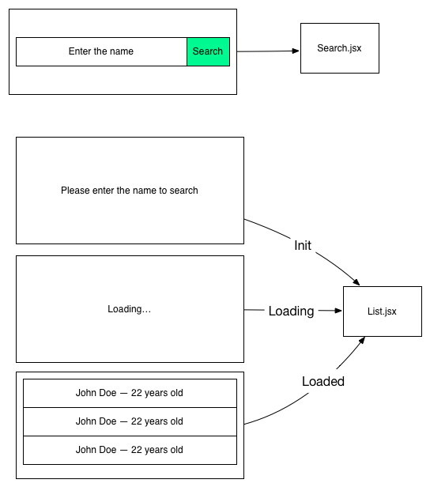
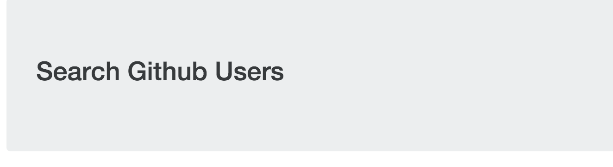
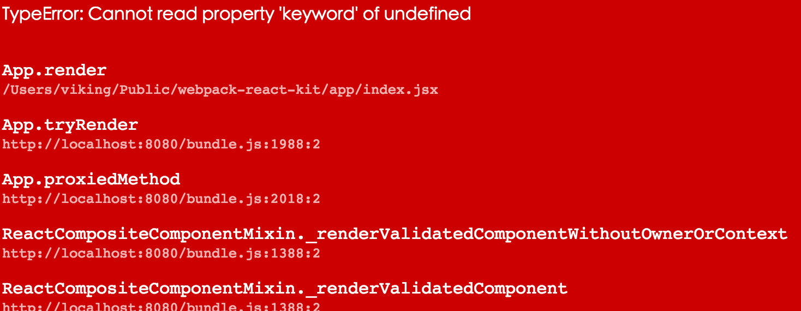
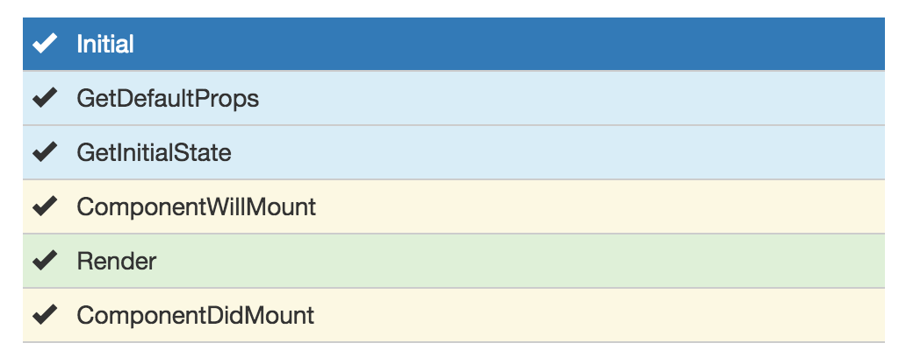
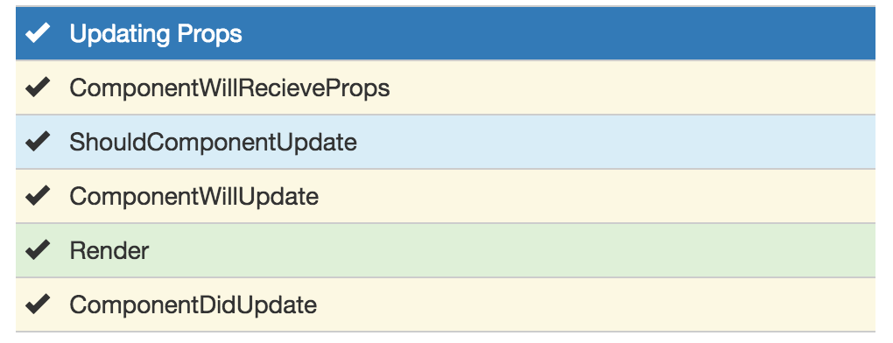
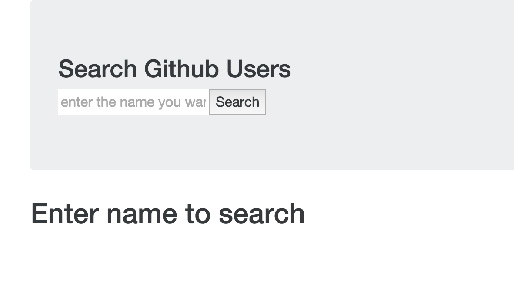
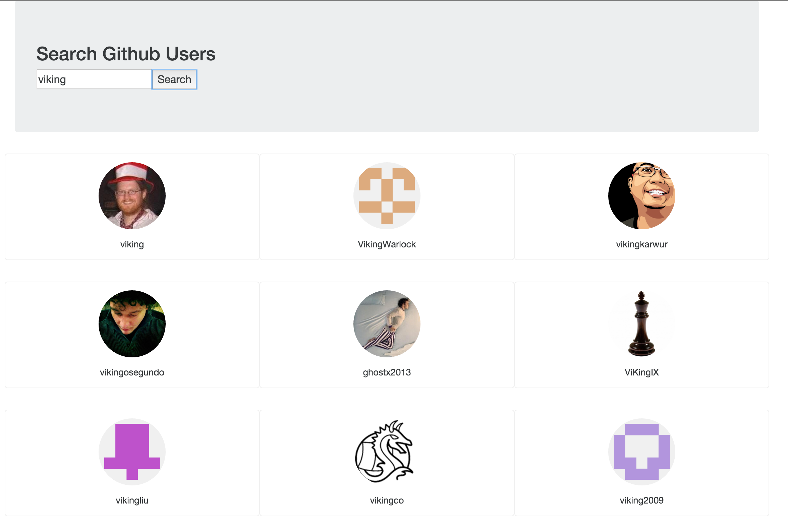

# Webpack傻瓜指南（三）和React配合开发

经过两章的学习，大家都了解Webpack的基本和高阶一点的用法，那么最后一章来说说和现在前端届的明星React一起合作的故事。
本文适合对React有一定了解的朋友，如果还不知道React是啥，请前往官方网站学习一下基本的概念和例子。

如果您还没有阅读前面两篇关于webpack的基础和进阶，请先务必阅读之前的文章。
* [Webpack傻瓜式指南（一） - 前端外刊评论 - 知乎专栏](http://zhuanlan.zhihu.com/FrontendMagazine/20367175)
* [Webpack傻瓜指南（二）开发和部署技巧](http://zhuanlan.zhihu.com/FrontendMagazine/20397902)

## 什么是React

React是一个由Facebook开发的library，它的口号是“A JAVASCRIPT LIBRARY FOR BUILDING USER INTERFACES”，用于构建用户界面的库。他的特点是仅仅关注于UI层，和其他的一系列大型的框架（Ember.js和Angular.js等）的理念不同，上述两个框架给你提供了一整套的解决方案。还有一个重大的改革就是React采用了一种独特的技术被称为virtual DOM ，和其他传统框架的DOM渲染过程不同，提供了更高性能的渲染，

> 如果你对virtual DOM感兴趣，可以看看这个库：[Matt-Esch/virtual-dom](https://github.com/Matt-Esch/virtual-dom)

> 如果你想深入了解React 请前往官方网站[React.js](https://facebook.github.io/react/)

## 为什么要用React和Webpack配合在一起

现在有很多的构建工具，采用Webpack的原因就是简单易用，容易上手，并且对React完美的支持，比如说JSX语法，使用babel-loader以后可以很完美的支持，支持Hot Loading Component,让你不用忍受页面刷来刷去的痛苦，还有就是配置简单，loaders的魔力是没人能够拒绝的。

如果你的下一个项目采用React做为View的展示框架，不妨再使用Webpack一起搭建一个开发环境。

## 配置React和Webpack

现在开始配置，把两个库的魔力融合在一起，在这里同样是实践出真知，来做一个小项目一步步完成这部教程，项目很简单，不是已经被别人做烂了的Todo了，这个项目可以搜索github上的用户名称，并且展示出来搜索出来的信息。
先画一个原型图：


从上图可以看出 项目有两个components，一个是搜索框，一个是展示列表，列表有几种状态，初始状态，正在读取数据，数据读取完毕展示列表。

根据原型图，项目应该有如下简单的结构

**程序结构**

* app/
  * index.jsx(程序入口)
  * components/(组件文件夹)
  	* plist.jsx(展示用户列表)
  	* search.jsx(搜索框组件)
  * utils/(一些小工具)
* package.json
* webpack.config.js


### 配置Babel让React支持ES6

在前面的文章里面我们多次提到了Babel，对于React来说，Babel更是一个完美的伙伴。

同时React也做了更新，更好的支持了ES6的写法。

如果你现在还是用这种方法写你的component

```javascript
var List = React.createClass({
	getInitialState: function() {
		return ['a', 'b', 'c']
	},
	render: function() {
		return ( ... );
	}
});
```

那么是时候采用ES6的写法了 [React ES6 classes](https://facebook.github.io/react/docs/reusable-components.html#es6-classes) 这种写法看起来更棒，可读性也更强。一个直观的发现就是不用写getInitialState方法了，可以直接在constructor里面定义this.state的值，前端一直都是在高速前进的，采用最新的标准，使用最新的技术，这应该是每个人的追求，对吧。

```javascript
import React from 'react';

class List extends React.Component {
	constructor() {
		super();
		this.state = ['a', 'b', 'c'];
	}
	render() {
		return (...);
	}
}
```

**安装babel-loader**

为了让上述的写法变成现实。需要安装bable和babel的两个preset：

```bash
//install babel core
npm install babel-loader --save-dev
//install es6 support and react support
npm install babel-preset-es2015 babel-preset-react --save-dev
```

这里安装了babel的主体和两个babel的preset, 什么是preset呢，你可以把preset看成一个包，里面有各种各样一系列的插件。

* babel-preset-es2015 es6语法包，有了这个，你的代码可以随意的使用es6的新特性啦，const,箭头操作符等信手拈来。
* babel-preset-react react语法包，这个包，是专门作为react的优化，让你在代码中可以使用React ES6 classes的写法，同时直接支持JSX语法格式。
更多详情，请到[Babel Plugins](https://babeljs.io/docs/plugins/)看一下这两个语法包都包括什么插件，每个插件都有什么特性。


**配置webpack**

像我们在前面做到一样，创建webpack.config.js

```javascript
var path = require('path');
var webpack = require('webpack');
var HtmlwebpackPlugin = require('html-webpack-plugin');

var ROOT_PATH = path.resolve(__dirname);
var APP_PATH = path.resolve(ROOT_PATH, 'app');
var BUILD_PATH = path.resolve(ROOT_PATH, 'build');

module.exports= {
  entry: {
    app: path.resolve(APP_PATH, 'index.jsx')
  },
  output: {
    path: BUILD_PATH,
    filename: 'bundle.js'
  },
  //enable dev source map
  devtool: 'eval-source-map',
  //enable dev server
  devServer: {
    historyApiFallback: true,
    hot: true,
    inline: true,
    progress: true
  },
  //babel重要的loader在这里
  module: {
    loaders: [
      {
        test: /\.jsx?$/,
        loader: 'babel',
        include: APP_PATH,
        query: {
          //添加两个presents 使用这两种presets处理js或者jsx文件
          presets: ['es2015', 'react']
        }
      }
    ]
  },
  plugins: [
    new HtmlwebpackPlugin({
      title: 'My first react app'
    })
  ]
}

```

这里还需要添加一个resolve的参数，把jsx这种扩展名添加进去，这样就可以在js中import加载jsx这种扩展名的脚本

```javascript
  ...
  resolve: {
      extensions: ['', '.js', '.jsx']
  },
  ...
```

**npm中添加webpack启动命令**

就像第一章里面介绍的，把命令添加到package.json里面。

package.json
```
  ...
  "scripts": {
    "dev": "webpack-dev-server --progress --profile --colors --hot",
    "build": "webpack --progress --profile --colors",
    "test": "karma start"
  },
  ...
```

**添加首页**

安装React和React-Dom

```bash
npm install react react-dom --save
```

让样式好看点，添加一个Bootstrap 4

```bash
npm install bootstrap@4.0.0-alpha.2 --save-dev
```

为了处理scss 需要添加sass loader 第一节讲过 大家都没忘记吧？

```bash
npm install css-loader style-loader sass-loader node-sass --save-dev

```

在webpack.config.js中添加处理的loader

```javascript
 ...
  module: {
    loaders: [
    ...
      {
        test: /\.scss$/,
        loaders: ['style', 'css', 'sass']
      }
    ...
    ]
  },
  ...
```


index.jsx
```javascript
import '../node_modules/bootstrap/scss/bootstrap.scss';
import React from 'react';
import ReactDOM from 'react-dom';

class App extends React.Component{
	constructor() {
		super();
	}
	render() {
		//JSX here!
		return (
	      <div className="container">
	        <section className="jumbotron">
	          <h3 className="jumbotron-heading">Search Github Users</h3>
	        </section>
	      </div>
		)
	}
};

const app = document.createElement('div');
document.body.appendChild(app);
ReactDOM.render(<App />, app);
```

再用webpack运行就可以看到结果了。

```bash
npm run dev
```

大标题出现了。伟大的Babel和Bootstrap都被正确使用了。



~~### 添加React Hot Loader~~

~~现在看起来已经不错了，但是我们要更完美。
发现现在每次修改一个component的代码，页面都会重新刷新，这会造成一个很不爽的问题，程序会丢失状态，当然现在在简单的程序中这个完全无所谓，但是假如程序变得越来越复杂，想要返回这种状态你可能又要经历一系列的点击等操作，会耗费一些时间。~~

~~对于一个jsx文件，先用react-hot-loader去处理它，然后再用babel-loader处理，你们也许发现query参数被移动到了babel?后面，这样看起来是有点不雅，但是这里有两个loader，不能直接把调用这个loader的参数写在外面，所以就这样啦。~~

~~修改完后，运行webpack，然后随便改动h1标题里面的文字，发现页面没有刷新，但是自动内容自动改变了，大功告成~~

### 添加React Transform支持

**更新** 上面所说的React Hot Loading已经过时了，开发者也宣布已经停止维护，现在有一个更强大的babel plugin： React Transform来代替他。

**锦上添花**

现在每次修改一个component的代码，页面都会重新刷新，这会造成一个很不爽的问题，程序会丢失状态，当然现在在简单的程序中这个完全无所谓，但是假如程序变得越来越复杂，想要返回这种状态你可能又要经历一系列的点击等操作，会耗费一些时间。如果更新代码以后可以只更新局部的组件，而对全局的页面不是直接强制刷新，那岂不是非常美妙？

上一节讲到webpack支持HMR（hot module replacement），这里自然而然就会想到这个解决方案。不过早就有一些人帮我们做好了类似的工作，只要简单安装一个babel的preset就可以轻松的完成这个工作。

```bash
npm install babel-preset-react-hmre --save-dev
```

这个preset里面其实包括两方面的东西：
* react-transform-hmr 用来实现上面所说的热加载。
* react-transform-catch-errors 用来捕获render里面的方法，并且直接展示在界面上。

配置一下.babelrc

```javascript
{
  "presets": ["react", "es2015"],
  //在开发的时候才启用HMR和Catch Error
  "env": {
   "development": {
     "presets": ["react-hmre"]
   }
  }
}
```

配置完毕，启动npm run dev。

看看效果。然后随便改动h1标题里面的文字，发现页面没有刷新，但是自动内容自动改变了，在render方法中故意弄一些错误，出现了红色错误提示，大功告成～~~



### 继续项目

完美配置了Webpack和React的开发环境，现在让我们把小项目完成吧。

根据上面的图 把项目分为两个主要的component，一个是Search Box用来让用户填写用户名， 一个是List，用来展示搜索到用户的列表.

Search Box非常的简单 就是两个input，当用户点击Search的时候，把输入的名字发送到List的组件里面。

```javascript

import React from 'react';
import ReactDOM from 'react-dom';
export default class Search extends React.Component {
  constructor(props) {
    super(props);
    this.handleSearch = this.handleSearch.bind(this);
  }
  handleSearch() {
     let name = ReactDOM.findDOMNode(this.refs.name).value;
     if (name === '') {
      return;
    }
    this.props.sendAction(name);
  }
  render() {
    return (
      <div>
        <input type="text" ref="name" placeholder="enter the name you wanna search"/>
        <button onClick={this.handleSearch}>Search</button>
      </div>    
     )
  }
}

```

List的目标是接受props传进来的name参数，发起一个ajax请求，然后用返回值更新整个列表，这个列表有几种状态
初始状态，第一次渲染返回一行提示文字。
Loading的状态，当有props传进来的时候，发起ajax请求，并且显示一个loading的提示。
完成状态，当请求完毕，渲染列表并且显示出来。

这个列表有不同的生命周期，这里简单介绍一下React Component的生命周期.

**初始化的生命周期**


如上图所描述的一样，当实例化一个Component的时候，会依次调用这些方法，所以在render完后做什么操作的话，可以把代码放到componentDidMount中。

**当props属性发生变化以后的生命周期**



如上图描述，当这个组件的props发送变化以后，会依次调用这些方法，当大体清楚了整个lifeCycle，是时候继续列表组件了。

```javascript
import React from 'react';
//自定义了一个ajax的方法，非常简单，支持promise
import {get} from '../utils/ajax';

export default class Plist extends React.Component {

  constructor(props) {
    super(props);
    this.state = {"loading":false, "list": []};
  }
  //当初次渲染完毕 设置该组件的属性firstView为true
  componentDidMount() {
    this.setState({"firstView": true});
  }
  //当传入的props有变化，请注意看上面第二张图，就是时候发起请求 更新列表的内容了
  componentWillReceiveProps(nextProps) {
    let keyword = nextProps.keyword;
    //loading设为true，firstView设为false
    this.setState({"loading": true, 'firstView': false});
    let url = `https://api.github.com/search/users?q=${keyword}`;
    //发起ajax请求
    get(url).then((data) => {
      //更新本组件的state
      this.setState({"loading":false, "list": data.items});
    }).catch((error) => {
      console.error(error);
    });
  }

  render() {
    const imgStyle = {
      width: '50px'
    }
    //添加一些if else的判断，用来展示不同的内容
    if (this.state.firstView) {
      return (
        <h2>Enter name to search</h2>
      )
    }
    if (this.state.loading) {
      return (
        <h2>Loading result...</h2>
      );
    } else {
      if (this.state.list.length === 0) {
        return (
          <h2>No result.</h2>
        )
      } else {
        return (
          <div className="row">
            {this.state.list.map(people=>{
              return (
                <div className="card">
                  
                  <p className="card-text">
                    {people.login}
                  </p>
                </div>
              )
            })}
         </div>       
       	);
      }
    }
  }
}

```
最后把两个组件引用到App里面

```javascript
import '../node_modules/bootstrap/scss/bootstrap.scss';
import React from 'react';
import Search from './components/search';
import Plist from './components/plist';

class App extends React.Component {

  constructor(props) {
    super(props);
    this.state = {"keyword": ""};
    this.refreshKeyword = this.refreshKeyword.bind(this);
  }

  refreshKeyword(name) {
    this.setState({"keyword": name});
  }

  render() {
    return (
      <div className="container">
        <section className="jumbotron">
          <h3 className="jumbotron-heading">Search Github Users</h3>
          <Search sendAction={this.refreshKeyword}/>
        </section>

        <Plist keyword={this.state.keyword}/>
      </div>    
    );
  }
}
```
大功告成！现在让webpack跑起来，看看成果。随便搜索一个关键词试一试:

**没有搜索的初始化界面**



**搜索以后的结果**



### 总结

这一节其实没有多少新的东西 经过前两节的学习 我们应该很容易自己就能做到React的配置了。这里我们使用一个小项目，更好的帮助大家了解。Webpack给React带来更多的便利。希望以后再做React的项目的时候，不妨采用Webpack来进行配合。由于篇幅的限制，这里没有介绍使用karma和webpack测试React Component，以后会专门介绍。

### 很硬的链接

这一节关于和React配合的代码单独的创建了一个Repo，如果你想使用webpack和React开始一个新项目，不妨可以把它当作一个Starter Kit。

[https://github.com/vikingmute/webpack-react-kit](https://github.com/vikingmute/webpack-react-kit)

同时这一系列关于Webpack的文章也可以在github找到

[https://github.com/vikingmute/webpack-for-fools](https://github.com/vikingmute/webpack-for-fools)
