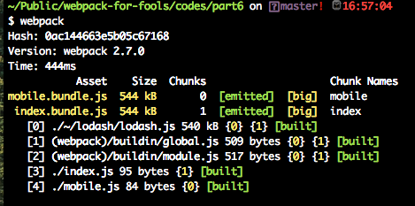
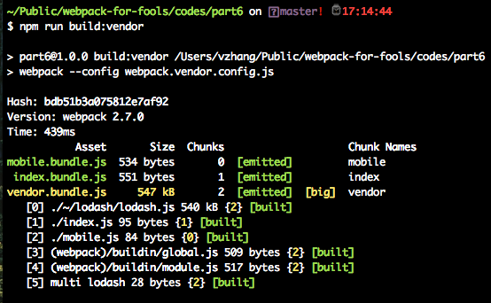

## 第二章 Webpack进阶：实战技巧
上一章我们通过一系列的例子入门了 webpack 的基本操作，在现实的开发过程中，我们遇见的问题往往比前面的几个简单例子要复杂的很多，那么在实战中可以总结为几个方面的内容，在下面的内容中一一道来。

* 开发环境
* code splitting 特性
* tree shaking 特性
* 生产环境
* lazy loading （懒加载）特性

### 2.1 开发环境

>>> 本节代码可以参见 /codes/part6/

在开发一个项目中，一个快速，简洁，功能强大的开发环境对程序员的开发效率和速度大有裨益。所以很多大型的 Javascript framework 都会创建自己的 cli 工具，例如 [angular cli](https://cli.angular.io/) 安装完毕后，运行 **ng serve** 就可以开启开发环境，用相对简单的命令为程序员构建一个强大的开发环境。现在用 webpack 也来构建一个强大的开发环境。

来想想在开发前端的项目过程中，有哪些非常有用的特性是我们非常喜欢的？

**使用 source maps**
上一章讲过，webpack 本质是一个 bundler，它会把多个相互依赖的文件打包成一个文件，那么如果在打包完毕的文件中出现错误，那么要想知道在源文件的哪行出现错误就是一个不可能完成的任务。为了解决这个难题，Javascript 推出了一个叫 [source map](http://blog.teamtreehouse.com/introduction-source-maps) 的文件格式。这个文件其实是一个JSON格式，里面像字典一样保存了生成的文件和源代码之间的对应关系。

在 webpack 中要使用 source maps 很简单，只需要在配置文件中加上简单一行就可以：

```javascript
module.exports = {
  ...
  // 开启 source map
  devtool: 'inline-source-map',
  ...
}
```
webpack 中可以配置好多种格式的 source map，在这里选用最简单的 inline-source-map ，更多的配置选项可以在[这里找到](https://webpack.js.org/configuration/devtool/)。

配置完毕后，为了验证source map 是否有用，打开hello.js， 把一行故意改错。

```javascript
// hello.js
// document.body.appendChild(node)
// 把document故意改错成 documenta 这个错误的名字
documenta.body.appendChild(node)
```
运行 webpack后，打开浏览器发现 console 中会出现如下错误。
```
ReferenceError: documenta is not defined
    at __webpack_exports__.a (hello.js:4)
```
这就说明我们的配置已经生效了，正确的提示了代码的错误的位置，inline-source-map 这种类型的配置是将 source map 直接集成到 bundle.js 中的，所以在 webpack 打包的过程中没有看到新的文件的生成，那么在生成环境中，这个配置就不太合适，它将会增大编译后代码的体积。

### 2.2  code splitting 特性

>>> 本节代码可以参见 /codes/part7/

在上一章中 我们提到了一段很简单的代码：

```javascript
module.exports = {
    // 入口文件名称
    entry: './index.js',
    // 输出文件名称
    output: {
        filename: 'bundle.js'
    }
}
```
这段代码非常简单移动，把入口文件打包成 bundle.js, 那么现在来进一步学习一下更复杂的用途。现在 entry 入口只接受一个字符串，也就是一个文件，只适合一个入口文件的场景。但是在现实开发的场景中，仅仅生成一个固定的文件是不够的，我们需要根据需求生成多个文件，进而还可以控制它们的加载顺序，这种做法对页面的加载速度大有裨益，当然 webpack 可以帮我们完成这个任务，这个特性就被称为 **code splitting**。下面就分几个场景来介绍一下该特性。

**多个 entry 入口文件**
现在 entry 属性只是一个字符串 ,它也可以是一个 object 对象，如果想要一个多页面的应用的话，那么肯定会需要多个入口文件。

现在的场景要生成两个文件，一个是为PC应用的称为 *index.js* ,一个是为移动端提供的，称为 *mobile.js* 。

```javascript
// index.js
import _ from 'lodash'

console.log(_.camelCase('FOO BAR'))
console.log('this is for pc page')
```

```javascript
// mobile.js
import _ from 'lodash'

console.log(_.now())
console.log('this is for mobile page')
```
这两个脚本完成针对不同特性完成不同的功能，现在来配置 webpack.config.js 来生成两个不同的打包文件。

```javascript
const webpack = require('webpack'); //to access built-in plugins

module.exports = {
    // 入口文件名称
    entry: {
        index: './index.js',
        mobile: './mobile.js'
    },
    // 输出文件名称
    output: {
        filename: '[name].bundle.js'
    }
}
```
大家注意在 output 中添加了 **[name]** 这个通配符，对应的是上面的 entry 的文件名称，其实这样的通配符还有很多，常用的有：

* internal chunk id : [id]
* unique hash generated for every build : [hash]
* hashes based on each chunks' content: [chunkhash]

现在来运行 webpack 命令，看看生成的文件


可以清晰的看到 生成了两个文件，这就是 code splitting 的体现。

**分离第三方库**

现在 build 之后生成两个文件，但是它们两个都包括了 lodash 这个库， 显然这不是我们想要的，如果文件体积太大的话，势必会造成加载速度变慢，最好的方法是把一些第三方常用的库(在这个例子里面为 lodash)单独的打包成一个单独的文件，而业务逻辑的代码打成另外一个文件。这样可以加快加载速度。

这里可以使用 webpack 内置的 CommonsChunkPlugin 来完成这个功能

这里新建一个文件称为 webpack.vendor.config.js

```javascript
const webpack = require('webpack'); //to access built-in plugins

module.exports = {
    // 入口文件名称
    entry: {
        index: './index.js',
        mobile: './mobile.js',
        // 新添加了 vendor 入口！
        vendor: ["lodash"],
    },
    plugins: [
        // 这里使用内置插件生成单独的 vendor file
        new webpack.optimize.CommonsChunkPlugin({
            name: "vendor"
        })
    ],
    // 输出文件名称
    output: {
        filename: '[name].bundle.js'
    }
}
```
修改一下 package.json 里面的 npm scripts，将不同命令对应不同的配置文件。

```javascript
//package.json
...
"scripts": {
  "build:split": "webpack --config webpack.config.js",
  "build:vendor": "webpack --config webpack.vendor.config.js"
},
...
```

万事具备，来运行 npm run build:vendor 命令，结果如图所示：


成功的生成了三个文件，将 lodash(vendor.bundle.js) 单独的打成了一个文件。
