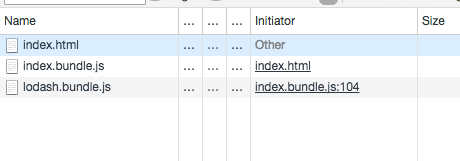
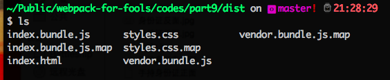

## 第二章 Webpack进阶：实战技巧

上一章我们通过一系列的例子入门了 webpack 的基本操作，在现实的开发过程中，我们遇见的问题往往比前面的几个简单例子要复杂的很多，那么在实战中可以总结为几个方面的内容，在下面的内容中一一道来。

* 开发环境
* code splitting 特性
* 动态加载
* tree shaking 特性
* 生产环境

### 2.1 开发环境

>>> 本节代码可以参见 /codes/part6/

在开发一个项目中，一个快速，简洁，功能强大的开发环境对程序员的开发效率和速度大有裨益。所以很多大型的 Javascript framework 都会创建自己的 cli 工具，例如 [angular cli](https://cli.angular.io/) 安装完毕后，运行 **ng serve** 就可以开启开发环境，用相对简单的命令为程序员构建一个强大的开发环境。现在用 webpack 也来构建一个强大的开发环境。

来想想在开发前端的项目过程中，有哪些非常有用的特性是我们非常喜欢的？

**使用 source maps**
上一章讲过，webpack 本质是一个 bundler，它会把多个相互依赖的文件打包成一个文件，那么如果在打包完毕的文件中出现错误，那么要想知道在源文件的哪行出现错误就是一个不可能完成的任务。为了解决这个难题，Javascript 推出了一个叫 [source map](http://blog.teamtreehouse.com/introduction-source-maps) 的文件格式。这个文件其实是一个JSON格式，里面像字典一样保存了生成的文件和源代码之间的对应关系。

在 webpack 中要使用 source maps 很简单，只需要在配置文件中加上简单一行就可以：

```javascript
module.exports = {
  ...
  // 开启 source map
  devtool: 'inline-source-map',
  ...
}
```
webpack 中可以配置好多种格式的 source map，在这里选用最简单的 inline-source-map ，更多的配置选项可以在[这里找到](https://webpack.js.org/configuration/devtool/)。

配置完毕后，为了验证source map 是否有用，打开hello.js， 把一行故意改错。

```javascript
// hello.js
// document.body.appendChild(node)
// 把document故意改错成 documenta 这个错误的名字
documenta.body.appendChild(node)
```
运行 webpack后，打开浏览器发现 console 中会出现如下错误。
```
ReferenceError: documenta is not defined
    at __webpack_exports__.a (hello.js:4)
```
这就说明我们的配置已经生效了，正确的提示了代码的错误的位置，inline-source-map 这种类型的配置是将 source map 直接集成到 bundle.js 中的，所以在 webpack 打包的过程中没有看到新的文件的生成，那么在生成环境中，这个配置就不太合适，它将会增大编译后代码的体积。

### 2.2  code splitting 特性

>>> 本节代码可以参见 /codes/part7/

在上一章中 我们提到了一段很简单的代码：

```javascript
module.exports = {
    // 入口文件名称
    entry: './index.js',
    // 输出文件名称
    output: {
        filename: 'bundle.js'
    }
}
```
这段代码非常简单移动，把入口文件打包成 bundle.js, 那么现在来进一步学习一下更复杂的用途。现在 entry 入口只接受一个字符串，也就是一个文件，只适合一个入口文件的场景。但是在现实开发的场景中，仅仅生成一个固定的文件是不够的，我们需要根据需求生成多个文件，进而还可以控制它们的加载顺序，这种做法对页面的加载速度大有裨益，当然 webpack 可以帮我们完成这个任务，这个特性就被称为 **code splitting**。下面就分几个场景来介绍一下该特性。

**多个 entry 入口文件**
现在 entry 属性只是一个字符串 ,它也可以是一个 object 对象，如果想要一个多页面的应用的话，那么肯定会需要多个入口文件。

现在的场景要生成两个文件，一个是为PC应用的称为 *index.js* ,一个是为移动端提供的，称为 *mobile.js* 。

```javascript
// index.js
import _ from 'lodash'

console.log(_.camelCase('FOO BAR'))
console.log('this is for pc page')
```

```javascript
// mobile.js
import _ from 'lodash'

console.log(_.now())
console.log('this is for mobile page')
```
这两个脚本完成针对不同特性完成不同的功能，现在来配置 webpack.config.js 来生成两个不同的打包文件。

```javascript
const webpack = require('webpack'); //to access built-in plugins

module.exports = {
    // 入口文件名称
    entry: {
        index: './index.js',
        mobile: './mobile.js'
    },
    // 输出文件名称
    output: {
        filename: '[name].bundle.js'
    }
}
```
大家注意在 output 中添加了 **[name]** 这个通配符，对应的是上面的 entry 的文件名称，其实这样的通配符还有很多，常用的有：

* internal chunk id : [id]
* unique hash generated for every build : [hash]
* hashes based on each chunks' content: [chunkhash]

现在来运行 webpack 命令，看看生成的文件


可以清晰的看到 生成了两个文件，这就是 code splitting 的体现。

**分离第三方库**

现在 build 之后生成两个文件，但是它们两个都包括了 lodash 这个库， 显然这不是我们想要的，如果文件体积太大的话，势必会造成加载速度变慢，最好的方法是把一些第三方常用的库(在这个例子里面为 lodash)单独的打包成一个单独的文件，而业务逻辑的代码打成另外一个文件。这样可以加快加载速度。

这里可以使用 webpack 内置的 CommonsChunkPlugin 来完成这个功能

这里新建一个文件称为 webpack.vendor.config.js

```javascript
const webpack = require('webpack'); //to access built-in plugins

module.exports = {
    // 入口文件名称
    entry: {
        index: './index.js',
        mobile: './mobile.js',
        // 新添加了 vendor 入口！
        vendor: ["lodash"],
    },
    plugins: [
        // 这里使用内置插件生成单独的 vendor file
        new webpack.optimize.CommonsChunkPlugin({
            name: "vendor"
        })
    ],
    // 输出文件名称
    output: {
        filename: '[name].bundle.js'
    }
}
```
修改一下 package.json 里面的 npm scripts，将不同命令对应不同的配置文件。

```javascript
//package.json
...
"scripts": {
  "build:split": "webpack --config webpack.config.js",
  "build:vendor": "webpack --config webpack.vendor.config.js"
},
...
```

万事具备，来运行 npm run build:vendor 命令，结果如图所示：


成功的生成了三个文件，将 lodash(vendor.bundle.js) 单独的打成了一个文件。


### 2.3 动态加载

>>> 本节代码可以参见 /codes/part8/

上面的例子中使用 code splitting 特性成功的将一个生成很大的文件分割成了多个小力度的文件，这样对于脚本的加载速度有所提高，但是还是在网页加载的时候通过 script 标签，大家都知道 script 脚本的加载会阻塞浏览器之后的工作，那么这里我们更进一步，webpack 支持动态（异步）加载资源。

webpack 是通过 **import()** 这个语法来实现动态加载的，这个语法同时也是 ECMAScript 的官方提案。

现在来新建一个例子(index.js)， 在这个文件中，我们用 import() 来实现动态加载 lodash 这个库。

```javascript
// index
import(/* webpackChunkName: "lodash" */ 'lodash').then(_ => {
  alert(_.camelCase('CAMEL CASE FROM LODASH'))
}).catch(err => console.error('error happens!', err))

```

上面这段代码没有什么难度，只要记住 **import()** 方法返回一个 Promise，调用 then() 方法以后返回的就是动态加载的对象。值得注意的是在 'lodash' 前面有一行奇怪的注释  webpackChunkName: "lodash" , 这个在这里是必须的，它对应这个 webpack 配置文件的一个字段。那么现在就来看一下配置文件有什么特殊之处。

```javascript
// webpack.config.js
const webpack = require('webpack'); //to access built-in plugins

module.exports = {
  // 入口文件名称
  entry: {
    index: './index.js',
  },
  // 输出文件名称
  output: {
    filename: '[name].bundle.js',
    // 添加这个来实现动态加载
    chunkFilename: '[name].bundle.js',
  }
}
```
大家注意到了在 output 中有一个 chunkFilename属性，它决定了非入口文件的第三方文件的命名，而上面代码中的 webpackChunkName 就决定这个 [name] 这个变量的值，所以生成的文件应该是 lodash.bundle.js。

如果你像了解更详细的 chunkFilename 和 import() 函数里面的参数，可以参阅文档：
[chunkFilename](https://webpack.js.org/configuration/output/#output-chunkfilename)
[import() 函数](https://webpack.js.org/api/module-methods/#import-)


现在运行 webpack 命令，console 的生成正如我们的预料，生成了 index.bundle.js 和 lodash.bundle.js 两个文件。

新建一个文件 index.html 同时引入 index.bundle.js。

```html
<html>
  <head>
    <title> This is the example for Dynamic Imports </title>
  </head>
  <body>
    <script src="index.bundle.js"></script>
  </body>
</html>
```
然后再浏览器中打开这个文件。浏览器成功的弹出了 camelCaseFromLodash，说明 lodash 已经被成功的加载并执行。打开 开发者工具的 network 面板，如下图所示:


发现一个有趣的事实，lodash.bundel.js 这一列，有一个属性叫 Initiator，这是发起者的意思，这就说明 lodash 这个文件的请求发起来自于 index.bundle.js 的 104 行，这样也就印证了 lodash 是由 index 异步加载的。

根据这个特性，还可以实现懒加载（lazy loading）的功能，那就是到特定的流程或者路由就调用 import() 函数动态加载和当前页面状态有关系的脚本文件。如果你前端时候 React.js ，那么你可以参阅[React Code Splitting and Lazy Loading ](https://reacttraining.com/react-router/web/guides/code-splitting) 来了解针对 React.js 合适的解决方案。

### 2.4 Tree shaking

可以想象我们的应用程序是一颗大树，大树上有非常多的枝叶，有用的源代码和第三方代码就像是绿色健康的叶子，而那些在程序中没有用到没有执行的代码就像是那些枯黄的树叶。顾名思义，tree shaking 就是摇晃这颗大树，让那些凋零的叶子都会自动掉下来。在 webpack 中，它的意思就是可以自动的删除那些没有被使用到的代码。这种方法又提出了一个概念称之为“编译中优化”，意思就是说在编译过程中通过各种方法来优化输出代码的结果。这个概念最早是被 Rollup 这个工具提出来的，webpack 将他发扬光大，它自带 tree shaking 的支持。

在这里简单讲一下如果想使用 webpack 中的 tree shaking 优化应该怎样配置，其实非常简单，只要做到两点就可以自动启用这项优化。

* 使用 ES2015 的模块语法（import，export），我相信许多人在应用程序中已经使用了这种格式。
* 使用一个支持 tree shaking 的代码压缩工具。（比如说 UglifyJSPlugin）

注意 tree shaking 并不是 webpack 本身执行的代码优化，而是由第三方工具（例如 UglifyJSPlugin）来最终完成的真正优化处理。
由于该特性比较简单，就不单独已例子说明。只需要满足上面那两个条件就可以自动引入该优化方法。

安装 UglifyJSPlugin 插件

```bash
npm install --save-dev uglifyjs-webpack-plugin
```

在配置文件中引用

```javascript
// webpack.config.js
const UglifyJSPlugin = require('uglifyjs-webpack-plugin');
module.exports = {
  ...
  plugins: [
    new UglifyJSPlugin()
  ]

}
```

### 2.5 生产环境

>>> 本节代码可以参见 /codes/part9/

之前我们了解了针对开发环境配置 webpack 的特性，包括 source map， 和之前提到的支持实时编译和 HMR 的本地服务器。那么生产环境和开发环境的目的完全不同，生产环境最重要的目的就是生成文件的大小，在当今的网路时代，加载速度就是第一生命力，那么生成文件的大小是一个非常重要的因素。

既然是两个完全不同的目的，那么这里我们推荐使用两个不同的配置文件完成不同的任务。可以把开发环境的配置文件称为 webpack.dev.js, 生产环境称为 webpack.prod.js。

那这里的测试项目就稍微复杂一点，它由一个入口文件(index.js)，一个样式文件(style.js)，和两个个第三方依赖（React，react-dom）组成。

安装依赖：
```bash
npm install react react-dom --save
```


然后写入口文件：
```javascript
// index.js
import React from 'react'
import { render } from 'react-dom' 
import './style.css'

var container = document.body.appendChild(
  document.createElement('div')
)

var element = React.createElement(
  'h1',
  null,
  'Hello, world!'
);

render(element, container)
```
这里就是把一个简单的 React Element 渲染到一个 DOM 节点上，由于这里没有配置 Babel，我没有使用 JSX 也没有使用 ES2015 的语法。它最后生成的效果是这样的。


开发环境的配置文件大家可以说是非常的熟悉，在这里再写一遍

```javascript
// webpack.dev.js
const HtmlWebpackPlugin = require('html-webpack-plugin'); //installed via npm
const webpack = require('webpack'); //to access built-in plugins

module.exports = {
    // 入口文件名称
    entry: './index.js',
    // 输出文件名称
    output: {
        filename: 'bundle.js'
    },
    devtool: 'inline-source-map',
    module: {
    	rules: [
    	   { test: /\.css$/, use: [ { loader: 'style-loader' }, { loader: 'css-loader' } ]}
    	]
    },
    plugins: [
      new webpack.HotModuleReplacementPlugin(),
      new HtmlWebpackPlugin({
        title: 'Test App',
      })
  	],
    devServer: {
        compress: true,
        hot: true,
        hotOnly: true,
    }
}
```
回顾一下前面的知识，这里针对开发环境添加了最直观的 inline-source-map，启用了 webpack-dev-server，并且添加了 HMR 的插件。

那么对比开发环境，针对生产环境的目的，我们对应一个全新的配置文件：

```javascript
const HtmlWebpackPlugin = require('html-webpack-plugin'); //installed via npm
const ExtractTextPlugin = require("extract-text-webpack-plugin");
const webpack = require('webpack'); //to access built-in plugins
const path = require('path');

module.exports = {
    // 入口文件名称
    entry: {
      index: './index.js',
      vendor: ['react', 'react-dom'],
    },
    // 输出文件名称
    output: {
      path: path.resolve(__dirname, 'dist'),
      filename: '[name].bundle.js',
    },
    devtool: 'source-map',
    module: {
    	rules: [
    	   { 
           test: /\.css$/, 
           use: ExtractTextPlugin.extract({
                  fallback: "style-loader",
                  use: "css-loader"
                })
          }
        ]
    },
    plugins: [
      new webpack.optimize.UglifyJsPlugin({
        sourceMap: true
      }),
      new ExtractTextPlugin("styles.css"),
      new webpack.optimize.CommonsChunkPlugin({
          name: "vendor"
      }),
      new HtmlWebpackPlugin({
        title: 'Test App',
      })
  	]
}
```
我们发现上面的配置文件和开发环境的配置有很多不同，大约有这几点是为了生产环境的优化而做：
* vendor: ['react', 'react-dom'] 和 new webpack.optimize.CommonsChunkPlugin({name: "vendor"}) 将较大的第三方库单独的打成一个文件，这样有利于更快的加载，这是利用了之前所讲过的 code splitting 技术。
* 使用 webpack.optimize.UglifyJsPlugin 来压缩生成的代码并且通过 tree shaking 技术来缩小生成文件的大小。
* 使用 devtool: 'source-map', 我们希望在生成环境中也能有 sourceMap 来追踪错误以及便于调试代码，所以需要一个快速并且便捷的 sourceMap 类型, 这个配置会另外生成一个压缩版本的 map 文件，注意不要在生成环境使用 'inline-source-map' 这个配置，这样会大幅增加生成文件的大小。
* 在之前一章 Loader 一节我们讲过 css 样式是通过 style-loader 动态通过 Javascript 插入到 head 中的，这种做法有两个弊端就是当 JS 文件没有加载完成的时候，页面会完全没有样式，而且会无端的增大 JS 文件的大小，我们希望能单独生成一个 CSS 文件，使用我们熟悉的方法来在 html 文件中引入这个 CSS 文件，这里可以使用 ExtractTextPlugin 这个插件来生成这个单独的 CSS 文件，具体配置可以看上面的时候方法。

然后将生产环境的打包命令添加到 npm scripts 当中。

```javascript
// package.json
"scripts": {
  "dev": "webpack-dev-server --config webpack.dev.js"
  "build": "webpack --config webpack.prod.js"
},
```
现在来运行 npm run build 命令看看效果怎样。
我们发现 dist 文件夹里面生成了几个新的文件，如下图所示。



* index.bundle.js 生成的主要 JS 文件
* vendor.bundle.js 生成的第三方文件库
* style.css 单独生成的 css 样式文件
* index.html HtmlWebpackPlugin 生成的 html 文件
* 还有所有JS和样式文件的 sourceMap (.map) 文件

通过这个配置文件，我们基本了解了对于生产环境打包的各种注意事项。最后还有一点要同学们特别注意：

**配置 node 环境变量**

许多框架和库（比如 React 和 Redux）都会根据 **process.env.NODE_ENV** 这个变量来决定要把多少另外的代码包含进去。假如这个变量不等于 production 的话，那么很有可能就会添加更多的 log 和 测试信息，让开发者开发的时候更容易发现问题。反之，如果是生产环境，那么这些额外的代码都将不会被包含进去，它关注的和我们之前生产环境关注的点一样：那就是文件的大小和加载的速度。

所以需要 webpack 内置的 *DefinePlugin* 来确定这些代码库的环境变量。

有个这个插件只需要在配置文件中这样添加：

```javascript
// webpack.prod.js
...
plugins: [
+  new webpack.DefinePlugin({
+       'process.env.NODE_ENV': JSON.stringify('production')
+  }),
  new webpack.optimize.UglifyJsPlugin({
    sourceMap: true
  }),
  new ExtractTextPlugin("styles.css"),
  new webpack.optimize.CommonsChunkPlugin({
      name: "vendor"
  }),
  new HtmlWebpackPlugin({
    title: 'Test App',
  })
]
...
```
这样添加上面插件的内容，可以将当前的环境变量设置为 production，这样让对环境变量有特殊设置的第三方库或者框架就可以完成优化，我们对比一下加这个插件和不加所生成的 vendor（React + react-dom） 文件的大小：原始大小 （283Kb），加了插件的大小 （101Kb）。我们可以显著的发现，文件大小的差异是惊人的！

